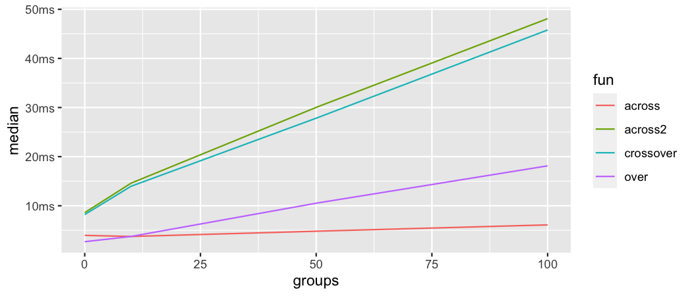
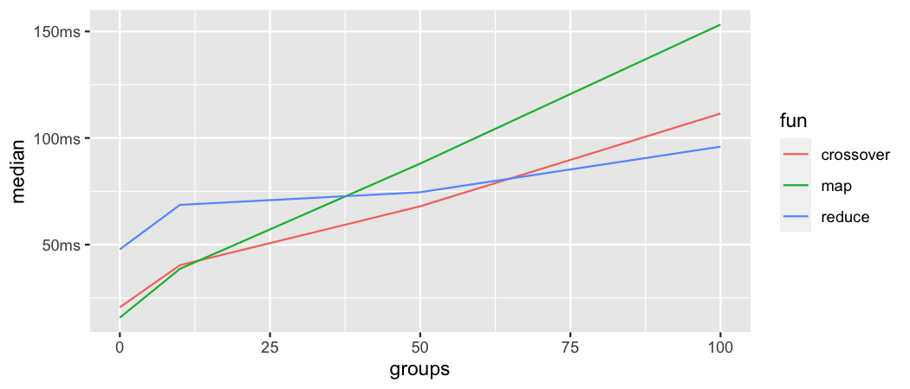

```{r, setup, include = FALSE}
options(
  tibble.print_min = 4,
  tibble.max_extra_cols = 8,
  digits = 2,
  crayon.enabled = FALSE,
  cli.unicode = FALSE
)
knitr::opts_chunk$set(
  collapse = TRUE,
  comment = "#>",
  fig.width = 7
)
library(dplyr)
library(tidyr)
library(purrr)
library(dplyover)
library(ggplot2)
library(bench)

diamonds_10grp <- diamonds %>% 
  group_by(grp_id = row_number() %% 10)

diamonds_50grp <- diamonds %>% 
  group_by(grp_id = row_number() %% 50)

diamonds_100grp <- diamonds %>% 
  group_by(grp_id = row_number() %% 100)

timings <- readRDS("performance.rds")
```

## Introduction

Although {dplyover} is an extension of {dplyr}, it doesn't make use of (read: copy)
{dplyr} internals. This made it relatively easy to develop the package without (i)
copying tons of {dplyr} code, (ii) having to figure out which dplyr-functions use
the copied internals and (iii) finally overwritting these functions (like `mutate`
and other one-table verbs), which would eventually lead to conflicts with other
add-on packages, like for example {tidylog}.

However, the downside is that not relying on {dplyr} internals has some negative
effects in terms of performance and compability.

In a nutshell this means:

 - The *over-across function family* in {dplyover} is slower than the
 original `dplyr::across`. Up until {dplyr} 1.0.3 the overhead was not too big,
 but `dplyr::across` got much faster with {dplyr} 1.0.4 which why the gap has
 widend a lot.
 - Although {dplyover} is designed to work in {dplyr}, some features and
 edge cases will not work correctly.
  
The good news is that even without relying on {dplyr} internals most of the
original functionality can be replicated, and although being less performant,
the current setup is optimized and falls not too far behind in terms of speed -
at least when compared to the 1.0.3 <= version of `dplyr::across`.

Regarding compability, I have spent quite some time testing the package and
I was able to replicate most of the tests for `dplyr::across` successfully. 

Below both issues, compability and performance, are addressed in more detail.

Before we begin, here is our setup:
```{r, eval = FALSE}
library(dplyr)
library(tidyr)
library(purrr)
library(dplyover)
library(ggplot2)
library(bench)
```

## Compability

At the moment three unintended compability issues are worth mentioning:

#### Only partial support of mutate()'s .keep argument
Since {dplyr} 1.0 `mutate` has gained a `.keep` argument, which allows us to 
control which columns are retained in the output. This works well with genuine
{dplyr} functions like `across`:

```{r}
# diamonds %>% mutate(across(z, ~ .x + y),
#                     .keep = "used")
```
`.keep` not only recognizes that `across` is *used* on colum 'z', it also
registers that we *used* column 'y' in `across`'s `.fns` argument.
Unfortunately, `.keep` is only partially supported within {dplyover}. It works
with columns that are used inside the `.fns` argument.
```{r}
diamonds %>% mutate(over(1, ~ y + 1),
                    .keep = "used")
```
But it does not work with columns provide in the `.xcols` or `.ycols` argument
in `crossover` or `across2`.
```{r}
diamonds %>% mutate(crossover(y, 1, ~ .x + z),
                    .keep = "unused")
```
For this reason, `crossover`, `across2`, and `across2x` issue a warning when
`mutate`'s `.keep` argument is specified.

#### Differences in the glue syntax<br>
`dplyr::across()` allows the use of local variables in addition to `{col}` and
`{fn}` in the glue syntax of its `.names` argument. This is currently not
supported by the *over-across functions* in {dplyover}. To somewhat leviate this
issue the *over-across* functions allow character vectors to be supplied to 
the `.names` argument (similar to `poorman::across`).

Example:<br>
We can do this with `dplyr::across`:
```{r}
prefix <- "lag1"
# tibble(a = 1:25) %>%
#   mutate(across(everything(), lag, 1, .names = "{.col}_{prefix}"))
```

In {dplyover} we would need to construct the names outside of the function call
and supply this vector to `.names`:
```{r}
col_nms <- "a_lag1"
tibble(a = 1:25) %>%
  mutate(over(1, ~ lag(a, .x), .names = col_nms))
```
Apart from supplying an external character vector to `.names` the
*over-across functions* have a special set of glue specifications that give more
control over how vectors are named. This should minimize the need to construct
the names externally and supply them as a vector. Please refer to the
documentation of each function to learn more about which special glue
specifications are supported.


#### Context dependent expressions: cur_column()<br>
When *over-across functions* are called inside `dplyr::mutate` or 
`dplyr::summarise` {dplyr}'s context dependent expressions (see `?dplyr::context`)
can be used inside the function call. An exception is `dplyr::cur_column()`
which works only inside `dplyr::across` and is neither supported in `across2`
nor `crossover`.


It is likely that there are more edge cases in which {dplyover}'s
*over-across functions* are behaving differently (in an unintended way) from its
relative `dplyr::across`. Feel free to contact me or just 
[open an issue on GitHub](https://github.com/TimTeaFan/dplyover/issues).


## Performance

{dplyover}'s performance issues are discussed in two steps. First, we compare
major {dplyover} functions with `dplyr::across` and look at the performance
of the internal setup. Since this is a rather theoretical comparison, we then
examine an actual operation using {dplyover}'s `crossover` and compare its 
performance to existing workarounds. 


#### Internal setup

To compare the performance of `dplyr::across` with the *over-across functions*
from {dplyover} we take the `diamonds` data set from the {ggplot2} package. Since
we are only interested in comparing the efficiency of the internal setup, we just
loop over a couple of columns / elements and apply a function returning `1` to 
make sure that no computation is involved. Finally, we use the `.names` argument
to name the output columns.

```{r, eval = FALSE}
diamonds %>%
  summarise(across(c(x,y,z),
                   ~ 1,
                   .names = "{col}_new"))
diamonds %>% 
  summarise(over(c("q","v","w"),
                 ~ 1,
                 .names = "{x}_new"))
```

```{r, echo = FALSE, eval = TRUE}
# over_across <- bench::mark(iterations = 50L, check = FALSE,
#     "over" = {
#     diamonds %>%
#       summarise(over(c("q","v","w"),
#                  ~ 1,
#                  .names = "{x}_new"))},
#     "across" = {
#     diamonds %>%
#       summarise(across(c(x,y,z),
#                        ~ 1,
#                        .names = "{col}_new"))}
# )
timings$over_across %>% 
  select(expression, median, mem_alloc) 
```

If we compare the performance of both operations, we can see that `over` is 
slightly faster than `dplyr::across`. This changes, however, when we consider
grouped data. To demonstrate this, we take the `diamonds` data set and create
four versions: an ungrouped version, one with 10, 50 and one with 100 groups.
Then we compare the same operations again. Now, we also add `crossover` and
`across2` to the benchmark.

Below is a code snippet for the 100 groups case:
```{r, eval = FALSE}

diamonds_100grp <- diamonds %>%
  group_by(grp_id = row_number() %% 100)

diamonds_100grp %>%
  summarise(across(c(x,y,z),
                   ~ 1,
                   .names = "{col}_new"))

diamonds_100grp %>% 
  summarise(over(c("q","v","w"),
                 ~ 1,
                 .names = "{x}_new"))

diamonds_100grp %>%
  summarise(crossover(c(x, y, z),
                      c(1:3),
                      ~ 1,
                      .names = "{xcol}_{y}"))

diamonds_100grp %>% 
  summarise(across2(c(x, y, z),
                    c(x, y, z),
                    ~ 1,
                    .names = "{xcol}_{ycol}"))
```

The plot below shows the median time in miliseconds that each operation takes
by increasing group size. Obviously, `dplyr::across` is by far the fastest (especially
after dplyr v.1.0.4). `over` is somewhat slower and the least performant operations
are `crossover` and `across2`. The latter two need to access the underlying data
and without using {dplyr}'s data mask there seems to be no good option to do that.

```{r, echo=FALSE, out.width="100%", fig.cap = "Benchmark of major dplyover functions" }

# across_bench <- bench::mark(iterations = 50L, check = FALSE,
#   "across 0" = {
#    diamonds %>%
#      summarise(across(c(x,y,z),
#                       ~ 1,
#                       .names = "{col}_new"))}, 
#   "across 10" = {
#    diamonds_10grp %>%
#      summarise(across(c(x,y,z),
#                  ~ 1,
#                .names = "{col}_new"))}, 
#   "across 100" = {
#    diamonds_100grp %>%
#      summarise(across(c(x,y,z),
#                        ~ 1,
#                       .names = "{col}_new"))}, 
#    "over 0" = {
#     diamonds %>% 
#       summarise(over(c("q","v","w"),
#                      ~ 1,
#                      .names = "{x}_new"))},
#   "over 10" = {
#     diamonds_10grp %>% 
#       summarise(over(c("q","v","w"),
#                      ~ 1,
#                      .names = "{x}_new"))},
#   "over 100" = {
#     diamonds_100grp %>% 
#       summarise(over(c("q","v","w"),
#                      ~ 1,
#                      .names = "{x}_new"))},
#   "crossover 0" = {
#     diamonds %>%
#       summarise(crossover(c(x, y, z),
#                           c(1:3),
#                           ~ 1,
#                           .names = "{xcol}_{y}"))},
#   "crossover 10" = {
#     diamonds_10grp %>%
#       summarise(crossover(c(x, y, z),
#                           c(1:3),
#                           ~ 1,
#                           .names = "{xcol}_{y}"))},
#   "crossover 100" = {
#     diamonds_100grp %>%
#       summarise(crossover(c(x, y, z),
#                           c(1:3),
#                           ~ 1,
#                           .names = "{xcol}_{y}"))},
#   "across2 0" = {
#     diamonds %>% 
#       summarise(across2(c(x, y, z),
#                         c(x, y, z),
#                         ~ 1,
#                         .names = "{xcol}_{ycol}"))},
#   "across2 10" = {
#     diamonds_10grp %>% 
#       summarise(across2(c(x, y, z),
#                         c(x, y, z),
#                         ~ 1,
#                         .names = "{xcol}_{ycol}"))},
#   "across2 100" = {
#     diamonds_100grp %>% 
#       summarise(across2(c(x, y, z),
#                         c(x, y, z),
#                         ~ 1,
#                         .names = "{xcol}_{ycol}"))}
#     )
# 
# across_bench %>%
#   tidyr::separate(expression,
#            into = c("fun", "groups"),
#            convert = TRUE) %>% 
#   ggplot(aes(x = groups, y = median, group = fun, color = fun)) +
#   geom_line() + 
#   scale_y_bench_time(base = NULL)


```

#### The performance of an actual operation

After getting a feeling for the general performance of the different functions in
the *over-across family* we next have a look at an actual operation and how 
it performs compared to available workarounds.

Below we come back to the second example from the vignette <a href="https://timteafan.github.io/dplyover/articles/why_dplyover.html#creating-several-lagged-variables-for-a-set-of-columns">"Why dplyover?"</a>.
We want to create several lagged variables for
a set of columns.

We compare `crossover` with two alternative approaches:

1. A call to `purrr:map_dfc` nested inside `dplyr::across` and
2. A call to `reduce2` in combination with a custom function.

```{r, eval = FALSE}
# crossover
diamonds %>% 
  mutate(crossover(c(x,y,z),
                    1:5,
                    list(lag = ~ lag(.x, .y)),
                    .names = "{xcol}_{fn}{y}"))

# across and map_dfc
diamonds %>% 
  mutate(across(c(x,y,z),
                ~ map_dfc(set_names(1:5, paste0("lag", 1:5)),
                          function(y) lag(.x, y))
                )) %>% 
  do.call(data.frame, .)

# custom function with reduce
create_lags2 <- function(df, .x, .y) {
    mutate(df, "{.x}_lag{.y}" := lag(!! sym(.x), .y))
}

diamonds %>% 
  reduce2(rep(c("x", "y", "z"), 5),
          rep(1:5,3),
          create_lags2,
          .init = .)
```

When used on ungrouped data `map_dfc` nested in `across` is the most
performant approach, while using a custom function with `reduce` is the least
performant. `crossover` is not too far off in terms of speed compared to the
`map_dfc` approach.

```{r, echo = FALSE, eval = TRUE}
create_lags <- function(df, .x, .y) {
    mutate(df, "{.x}_lag{.y}" := lag(!! sym(.x), .y))
}

lagged_vars <- bench::mark(iterations = 50L, check = FALSE,
  crossover = {
    diamonds %>%
      mutate(crossover(c(x,y,z),
                       1:5,
                       list(lag = ~ lag(.x, .y)),
                       .names = "{xcol}_{fn}{y}"))
  },
  across_map_dfc = {
    diamonds %>%
      mutate(across(c(x,y,z),
                    ~ map_dfc(set_names(1:5, paste0("lag", 1:5)),
                              function(y) lag(.x, y)))) %>%
    do.call(data.frame, .)
  },

  reduce_cst_fct = {
    diamonds %>%
  reduce2(rep(c("x", "y", "z"), 5),
          rep(1:5, 3),
          create_lags,
          .init = .)
  }
)

# saveRDS(list(over_across = over_across, lagged_vars = lagged_vars), "vignettes/performance.rds")

timings$lagged_vars %>% 
  select(expression, median, mem_alloc) 

```

This picture gets a little bit more complex when we compare each approach across
different group sizes. In the lower range (up until about 15 groups) `map_dfc`
nested in `across` is the fastest approach, with `crossover` being not much
slower. With increasing group size `crossover` starts to outperform `map_dfc`
up until around 60 groups where `reduce` finally takes over and delivers the
fastest performance. This benchmark stopped at 100 groups, but extrapolating
from the existing data, we see that `reduce` is the most scaleable approach
(although having the highest setup costs). If speed is a pressing concern, then
the use of repetitive code patterns in a regular `dplyr::across` call is a 
valid option that is still faster than any of the approaches shown here.

```{r, echo = FALSE, out.width = "100%", fig.cap = "Benchmark: lagging many variables"}
# create_lags <- function(df, .x, .y) {
#     mutate(df, "{.x}_lag{.y}" := lag(!! sym(.x), .y))
# }
# 
# lag_bench <- bench::mark(iterations = 50, check = FALSE,
#  
#   "map 0" = {
#     diamonds %>%
#       mutate(across(c(x,y,z),
#                     ~ map_dfc(set_names(1:5, paste0("lag", 1:5)),
#                               function(y) lag(.x, y)))) %>%
#     do.call(data.frame, .)
#     },
#   "map 10" = {
#     diamonds_10grp %>%
#       mutate(across(c(x,y,z),
#                     ~ map_dfc(set_names(1:5, paste0("lag", 1:5)),
#                               function(y) lag(.x, y)))) %>%
#     do.call(data.frame, .)
#     },
#   "map 100" = {
#     diamonds_100grp %>%
#       mutate(across(c(x,y,z),
#                     ~ map_dfc(set_names(1:5, paste0("lag", 1:5)),
#                               function(y) lag(.x, y)))) %>%
#     do.call(data.frame, .)
#     },
#   
#    "reduce 0" = {
#     diamonds %>%
#       reduce2(rep(c("x", "y", "z"), 5),
#               rep(1:5, 3),
#               create_lags,
#               .init = .)
#     },
#   "reduce 10" = {
#     diamonds_10grp %>%
#       reduce2(rep(c("x", "y", "z"), 5),
#               rep(1:5, 3),
#               create_lags,
#               .init = .)
#     },
#   "reduce 100" = {
#     diamonds_100grp %>%
#       reduce2(rep(c("x", "y", "z"), 5),
#               rep(1:5, 3),
#               create_lags,
#               .init = .)
#     },
#   
#   "crossover 0" = {
#     diamonds %>%
#       mutate(crossover(c(x,y,z),
#                        1:5,
#                        list(lag = ~ lag(.x, .y)),
#                        .names = "{xcol}_{fn}{y}"))
#   },
#   "crossover 10" = {
#     diamonds_10grp %>% 
#       mutate(crossover(c(x,y,z),
#                        1:5,
#                        list(lag = ~ lag(.x, .y)),
#                        .names = "{xcol}_{fn}{y}"))
#   },
#   "crossover 100" = {
#     diamonds_100grp %>% 
#       mutate(crossover(c(x,y,z),
#                        1:5,
#                        list(lag = ~ lag(.x, .y)),
#                        .names = "{xcol}_{fn}{y}"))
#   },
#   )
# 
# lag_bench %>%
#   separate(expression,
#            into = c("fun", "groups"),
#            convert = TRUE) %>% 
#   ggplot(aes(x = groups, y = median, group = fun, color = fun)) +
#   geom_line() + 
#   scale_y_bench_time(base = NULL)

```


## Conclusion

Above we shed some light on {dplyover} performance when used on grouped data 
as well as its compability with {dplyr}. Regarding the latter, we only saw minor
issues:

(1) `dplyr::mutate`'s `.keep` argument can be easily replaced wih a call to
`dplyr::select`
(1) `cur_column()` might not make as much sense in `crossover` and
`across2` as it does in `dplyr::across` and 
(1) as an alternative to the use of local variables within the `.names` argument,
all functions of the *over-across family* accept a character vector which can be
used to construct the variables names.

Regarding the performance of the *over-across functions* when applied to grouped
data we saw that they were far less performant than `dplyr::across`. However,
when looking at an actual use case, we saw that the timings were quite reasonable
compared to other programmatic alternatives.

Nevertheless, both issues, performance and compability, will be improved in 
future versions of {dplyover}.


